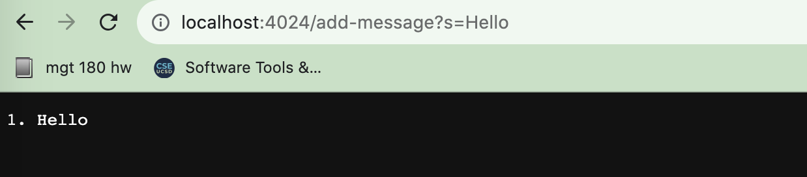
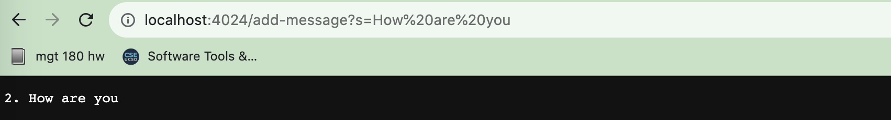
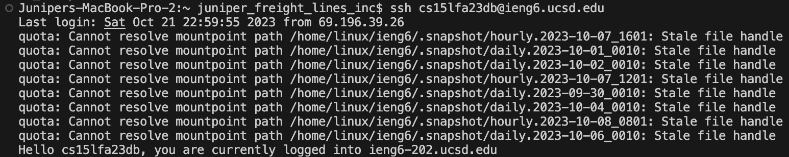

# Lab Report 2

## Part 1
```
import java.io.IOException;
import java.net.URI;


class Handler implements URLHandler {

    int num = 0;

    public String handleRequest(URI url) {
        if (url.getPath().contains("/add")) {
            String[] parameters = url.getQuery().split("=");
            for (int i = 0; i < parameters.length; i++) {
                System.out.println(parameters[i]);
            }
            if (parameters[0].equals("s")) {
                num += 1;
                return (num + ". " + parameters[1] + "\n");    
            }
            return "404 Not Found!";
        }
        return "";
    }
}
    
class StringServer {
    public static void main(String[] args) throws IOException {
        if(args.length == 0){
            System.out.println("Missing port number! Try any number between 1024 to 49151");
            return;
        }

        int port = Integer.parseInt(args[0]);

        Server.start(port, new Handler());
    }
}
```


1. Which methods called: In the main method, handleRequest is called
2. arguments: the url, first one is Hello
    - values: num, tracks times /add called
3. every time method called, and has /add num incremented

1. Which methods called: In the main method, handleRequest is called
2. arguments: the url, second one How are you
    - values: num, tracks times /add called
3. every time method called, and has /add num incremented

## Part 2
Path to private key: /Users/juniper_freight_lines_inc/.ssh/id_rsa
Path to public key: /Users/juniper_freight_lines_inc/.ssh/id_rsa.pub

Log In: 


## Part 3
I learned how to run a server, having a starter code that does most of the implementation is really helpful but I enjoyed messing around with the different paths and queries. I also learned how sensitive each line is. Changing one small thing made the server not run the way it was supposed to so that was also interesting. 
